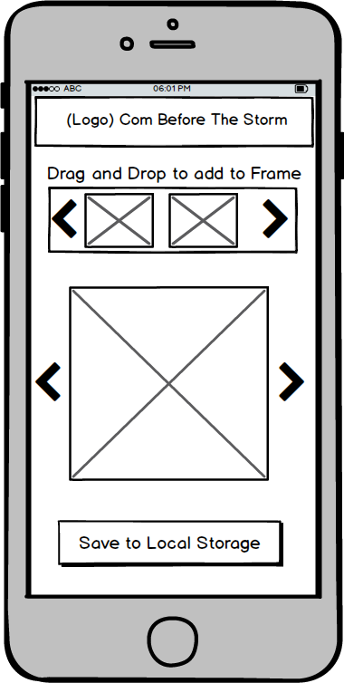

## ComStorm

### Background

Com Storm is a mobile app for making comics, built using React Native.

### Functionality and MVP

Users will be able to

- [ ] choose number of panels (from one to three)
- [ ] drag and drop templates on to the canvas
- [ ] add text to speech and thought bubbles
- [ ] save the created comic strip to their local storage

### Wireframes

### Technologies and Technical Challenges

### Group Members and Work Breakdown

Our group has three members, Nate Reiners, Ken Lee and Nandini Adhyapaka.

Nate's primary responsibilities will be:

-
-

Ken's primary responsibilities will be:

-
-

Nandini's primary responsibilities will be:

-
-

### Implementation Timeline

**Day 1**:

-
-

**Day 2**:

-
-

**Day 3**:

-
-

**Day 4**:

-
-

**Day 5**:

-
-

### Plan for getting users and reviews

-
-

### Bonus Features

- Allow users to upload their own images
- User authentication
